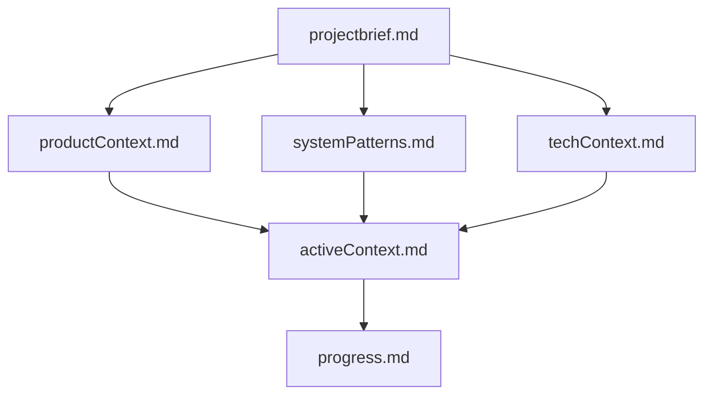

# Memory Bank - Order Integrator

Este é o Memory Bank do projeto Order Integrator, um sistema de documentação estruturada que mantém o contexto completo do projeto entre sessões de trabalho.

## 📋 Visão Geral

O Memory Bank é essencial porque a IA (Cursor) redefine sua memória a cada sessão. Estes arquivos servem como a única fonte de verdade sobre o projeto, suas decisões técnicas, progresso atual e próximos passos.

## 📁 Estrutura de Arquivos

### Core Files (Obrigatórios)

#### 🎯 `projectbrief.md`
**Documento fundacional** que define:
- Objetivo principal e escopo do projeto
- Funcionalidades core vs. fora do escopo
- Tecnologias utilizadas
- Critérios de sucesso
- Padrões de qualidade

#### 🏢 `productContext.md`
**Contexto de negócio** que explica:
- Problema que o projeto resolve
- Fluxo de operação completo
- Entidades de domínio e relacionamentos
- Requisitos não-funcionais
- Métricas de sucesso

#### 🏗️ `systemPatterns.md`
**Padrões arquiteturais** implementados:
- Clean Architecture com DDD
- Ports & Adapters pattern
- Padrões de código e convenções
- Estrutura de módulos NestJS
- Tratamento de erros e integração

#### 💻 `techContext.md`
**Contexto técnico** detalhado:
- Stack tecnológica completa
- Configuração do ambiente
- Scripts disponíveis
- Integrações externas
- Restrições e limitações

#### 🔄 `activeContext.md`
**Contexto atual** de trabalho:
- Status do projeto (última atualização)
- Funcionalidades implementadas
- Trabalho em andamento
- Próximas ações prioritárias
- Questões em aberto

#### 📊 `progress.md`
**Progresso detalhado** do projeto:
- Funcionalidades completadas ✅
- Parcialmente implementadas ⚠️  
- Não implementadas ❌
- Issues conhecidos
- Milestones planejados

## 🔄 Fluxo de Trabalho

### Para a IA (Cursor)
1. **Sempre ler** todos os arquivos do Memory Bank no início de cada sessão
2. **Consultar** os arquivos relevantes durante o trabalho
3. **Atualizar** os arquivos quando há mudanças significativas
4. **Manter** a sincronização entre arquivos

### Para Desenvolvedores
1. **Revisar** o Memory Bank antes de começar a trabalhar
2. **Atualizar** quando implementar novas funcionalidades
3. **Documentar** decisões técnicas importantes
4. **Manter** o contexto atualizado para futuras sessões

## 📝 Quando Atualizar

### Atualizações Obrigatórias
- ✅ Implementação de novas funcionalidades
- ✅ Mudanças arquiteturais significativas
- ✅ Descoberta de novos padrões/problemas
- ✅ Conclusão de milestones importantes
- ✅ Comando explícito "update memory bank"

### Atualizações Recomendadas
- 📝 Decisões técnicas importantes
- 📝 Mudanças de escopo ou requisitos
- 📝 Descoberta de limitações/bugs críticos
- 📝 Mudanças no roadmap do projeto

## 🎯 Hierarquia de Arquivos

**Legenda:**
- `projectbrief.md`: Base de tudo, define escopo e direção
- Arquivos de contexto: Detalham aspectos específicos
- `activeContext.md`: Consolida o estado atual
- `progress.md`: Rastreia execução detalhada

## ⚡ Quick Reference

### 🚀 Começando Nova Sessão
1. Ler `activeContext.md` primeiro (contexto atual)
2. Consultar `progress.md` para status detalhado  
3. Revisar `systemPatterns.md` para padrões técnicos
4. Usar outros arquivos conforme necessário

### 🔍 Procurando Informações
- **Arquitetura**: `systemPatterns.md`
- **Tecnologias**: `techContext.md`
- **Negócio**: `productContext.md`
- **Status atual**: `activeContext.md`
- **Progresso**: `progress.md`

### 📋 Planejando Trabalho
- **Próximas tarefas**: `activeContext.md` → "Próximas Ações"
- **Milestones**: `progress.md` → "Próximos Milestones"
- **Padrões a seguir**: `systemPatterns.md`

## 🛠️ Integração com .cursorrules

O arquivo `.cursorrules` complementa o Memory Bank com:
- Padrões específicos de código
- Convenções de nomenclatura
- Armadilhas a evitar
- Configurações específicas do projeto

**Uso conjunto**: Memory Bank fornece contexto, .cursorrules fornece regras de implementação.

---

**Importante**: Este Memory Bank é mantido manualmente e deve ser atualizado regularmente para manter sua eficácia. É o ponto central de conhecimento do projeto Order Integrator. 