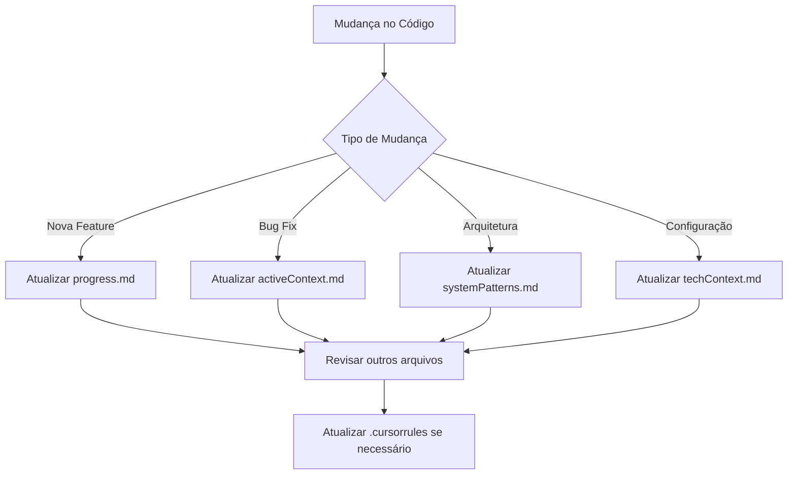

# Memory Bank - Order Integrator

## Visão Geral
Este Memory Bank contém toda a documentação viva do projeto Order Integrator. Como a memória do Cursor é resetada entre sessões, estes arquivos servem como fonte única de verdade sobre o estado, arquitetura e progresso do projeto.

## Estrutura dos Arquivos

### Arquivos Core (Obrigatórios)
1. **`projectbrief.md`** - Fundação do projeto
   - Escopo e objetivos principais
   - Requisitos funcionais e não funcionais
   - Tecnologias core utilizadas

2. **`productContext.md`** - Contexto de produto
   - Problemas resolvidos pelo sistema
   - Casos de uso e benefícios
   - Impacto no negócio

3. **`systemPatterns.md`** - Arquitetura e padrões
   - Arquitetura Hexagonal implementada
   - Padrões de design utilizados
   - Princípios SOLID aplicados

4. **`techContext.md`** - Contexto técnico
   - Stack tecnológico completo
   - Configuração de ambiente
   - Constraints e limitações

5. **`activeContext.md`** - Trabalho atual
   - Status atual do desenvolvimento
   - Problemas em andamento
   - Decisões técnicas recentes

6. **`progress.md`** - Progresso e planejamento
   - O que está funcionando
   - Problemas conhecidos
   - Backlog priorizado

## Como Usar

### Para o Cursor AI
- **Início de sessão**: Ler TODOS os arquivos core
- **Durante desenvolvimento**: Consultar activeContext.md e progress.md
- **Após mudanças**: Atualizar documentação relevante

### Para Desenvolvedores
- **Onboarding**: Começar por projectbrief.md → productContext.md
- **Desenvolvimento**: Seguir padrões em systemPatterns.md
- **Debugging**: Consultar techContext.md e .cursorrules

## Fluxo de Atualização

## Manutenção

### Quando Atualizar
- ✅ **Sempre**: Após implementar funcionalidades
- ✅ **Sempre**: Ao resolver problemas conhecidos
- ✅ **Sempre**: Quando padrões evoluem
- ✅ **Semanalmente**: Review geral de todos os arquivos

### Sinais de Desatualização
- ❌ Código não segue padrões documentados
- ❌ Problemas "conhecidos" já foram resolvidos
- ❌ Tecnologias mudaram mas documentação não
- ❌ Novos padrões emergiram não documentados

## Integração com .cursorrules
O arquivo `.cursorrules` complementa este Memory Bank com:
- Padrões de código específicos do projeto
- Preferências de desenvolvimento
- Comandos e debugging tips
- Inteligência específica da integração Bahn

## Status Atual
✅ **Memory Bank Inicializado**: Dezembro 2024  
📍 **Foco Atual**: Correção de DTOs e implementação de status codes HTTP  
🎯 **Próximo Marco**: Taxa de sucesso > 95% na integração Bahn

---
*Última atualização: Dezembro 2024 - Inicialização do Memory Bank* 